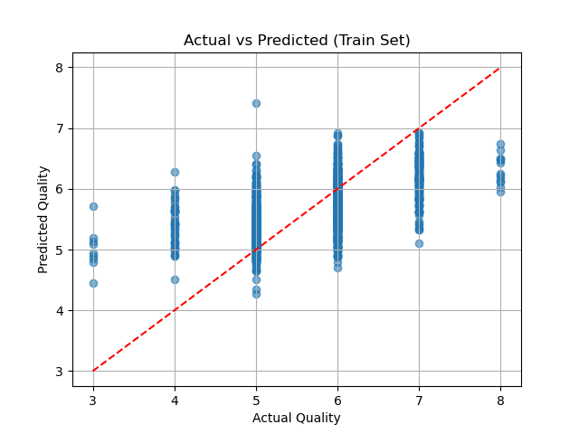

High level description of each part of code.  
a. Just loading and storing the data in an object.  
b. Splitting the data using an sklearn function. Do it randomly with arbitrary random state.  
c. Make X a matrix with all predictor values except quality which is the dependant variable. Make y a vector of only quality.  
d. Create a scatterplot. The better the prediction the closer to the included red line. The predictions are sort of clustered but it does not do well at predicting low values.  
e. A fucntion to return the mean squared error by simply computing it.  
f. Splits 25% of the training data into a validation set.  
g. An emplemntation to do gradient descent to try to optimize w (the vector of weights for the linear regression).  
h. Tests some step sizes (eta) to find the bes tone among those provided. Chose these arbitrarily, Trying different orders of magnitude. I included some with meaningful results, too large an eta will cause the returned w to grow out of control and will yield NaN.  
i. Train the LMS regression on the best w.  
j. Run it again and report the error.  

Here is the output: (not all the parts have an output).  
(d)   
(e) RMSE on Train Set: 0.6513  
    RMSE on Test Set: 0.6245  
(h) RMSE with η=1e-06: 0.7312  
(h) RMSE with η=2e-06: 0.7180  
(h) RMSE with η=5e-06: 0.7084  
(h) RMSE with η=1e-05: 0.7036  
(h) RMSE with η=2e-05: 0.7070  
    Best η: 1e-05  
(j) Final LMS RMSE on Train Set: 0.7050  
    Final LMS RMSE on Test Set: 0.7120  
    
